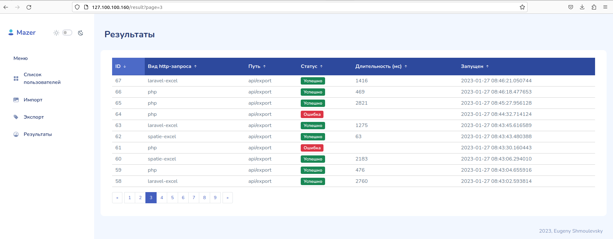
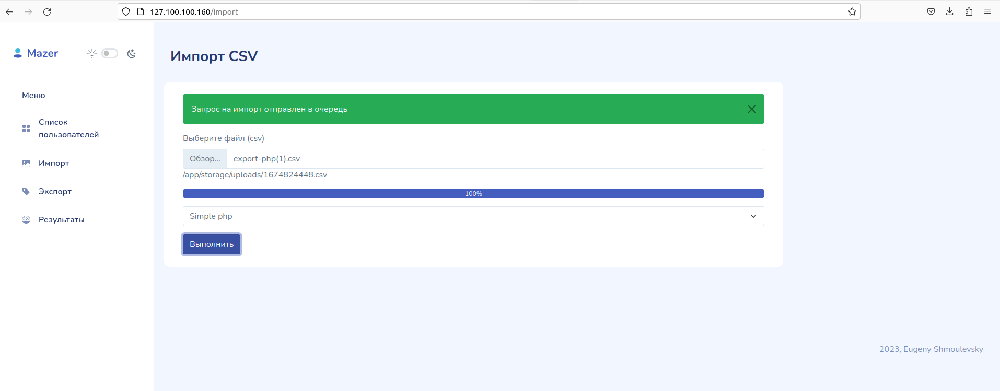
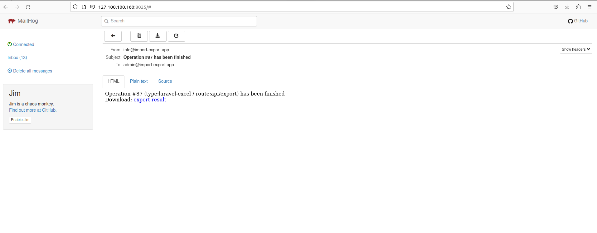
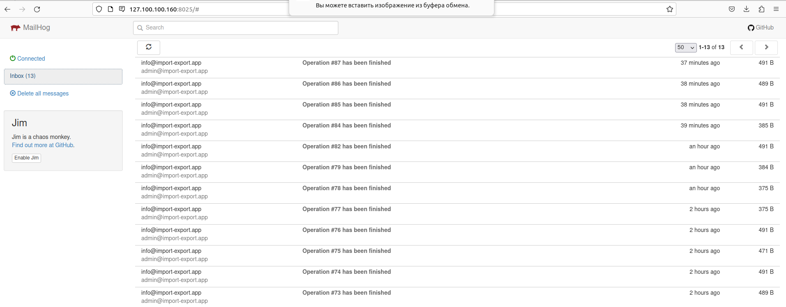
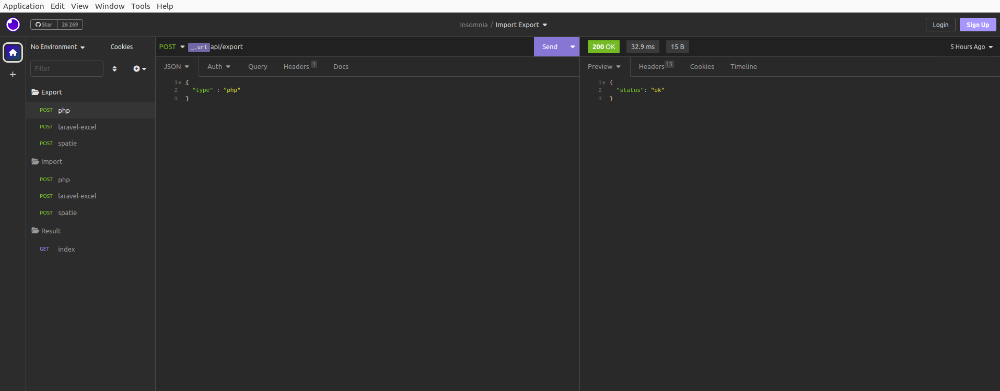

## Тестовое задание

Задание:

Постановка задачи: Необходимо выполнить импорт и экспорт большого объёма данных, используя 3 различных варианта (PHP, Laravel Excel, Spatie Simple Excel) и сравнить время их выполнения.

Реализация:

- Стек: Laravel, MySQL, Docker, Vue, bootstrap 5
- Для фронта использован Vue, bootsrap 5, Mazer free Bootstrap 5 template
- Настроен запуск через docker (контейнеры: php8.0, nginx, MySQL, supervisor, MailHog)
- Реализовано 3 варианта импорта/экспорта: чистый php, Laravel-Excel, Spatie Simple Excel
- Реализация импорта/экспорта на очередях (db+supervisor). По окончании job-а приходит письмо (для просмотра необходимо перейти на интерфейс Mailhog http://127.100.100.160:8025/#)
- Проект разбит на модули
- Для добавления нового варианта импорта/экспорта необходимо: добавить класс в папку handlers, добавтить констатнут в класс ImportType/ ExportType и также добавить создание класса в соответсвующую фабрику

Запуск:
- Для запуска выполнить make up (в корне лежит Makefile с прописаными командами). В случае если docker-compose версии ниже 2 то раскоментировать Makefile_bk и повторно запустить make up
- Для запуска терминала контейнера php make bash
- Создать env (из env.example)
- Выполнить php composer.phar install, php artisan migrate, npm install 
- Запустить сидеры php artisan db:seed, создать link - php artisan storage:link   
- Проект запускается на http://127.100.100.160
- Для доступа к MailHog http://127.100.100.160:8025
- Для доступа к phpMyAdmin http://127.100.100.160:8081 (db_import_export/app/root)
- Запуск сидера: php artisan db:seed (заполняет таблицу users)
- Также приложены эндпоинты для insomnia

Скриншеты:

